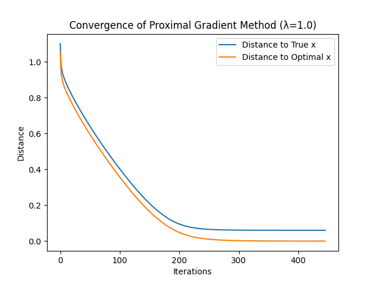
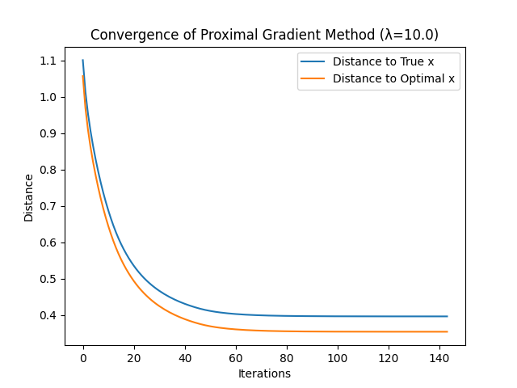
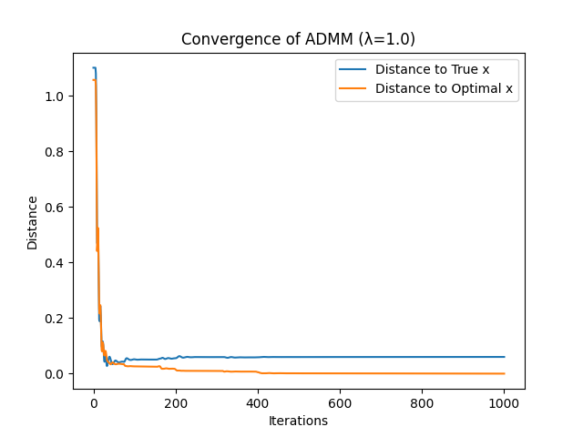
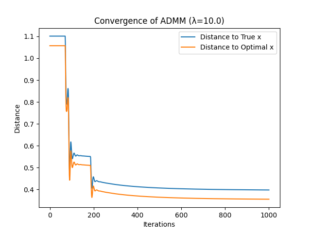
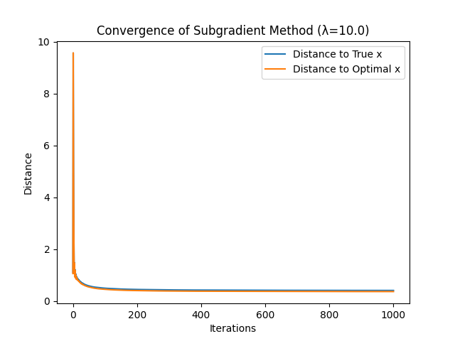

File: code\sampled_results.txt
```txt
### admm_lambda_0.1.csv ###
Iteration	Distance_to_True_x	Distance_to_Optimal_x
0	1.1010125412855643	1.0571204322270538
50	0.10214110739573362	0.08041408244828392
100	0.10002045985059144	0.07820000823767385
150	0.10069032658838337	0.07609847189299246
200	0.10116392236045765	0.07615050831272316
250	0.09908477348534261	0.07571953737633284
300	0.10011151877784162	0.07538564832990141
350	0.09973239604430632	0.0754122569926942
400	0.0996686539916454	0.07517504391414304
450	0.09990292155900207	0.07528865864506845
500	0.09953913382777485	0.07514900172368641
550	0.09976766548034104	0.07519819212119909
600	0.0996866251417712	0.07521658560917877
650	0.09960333639176089	0.07514005976107568
700	0.09974673459338902	0.07524686328438984
750	0.09960315696440784	0.07513218292945595
800	0.09968660421109865	0.07522265564589783
850	0.0996614091086975	0.07516847552972826
900	0.09965321803902094	0.07519709391676101
950	0.09966394410528946	0.0751803875880457
1000	0.09966439426428657	0.07519289639875519


### admm_lambda_1.0.csv ###
Iteration	Distance_to_True_x	Distance_to_Optimal_x
0	1.1010125412855643	1.0571204322270538
50	0.04109534561130602	0.036799056109446095
100	0.05182343479671332	0.026374824091239677
150	0.050782645994025516	0.02549982998101418
200	0.05568239893487517	0.015075799146503527
250	0.059785671969548496	0.010074462438423727
300	0.05971846156352608	0.009987770344422709
350	0.058619767093102695	0.007606607970302877
400	0.05900403252866313	0.005418824681288903
450	0.05987377268260923	0.0017528549573806193
500	0.05993720877507779	0.001429224864092936
550	0.060009275401895525	0.001235543086709159
600	0.06004486333418131	0.0011441689673797855
650	0.06007621199563442	0.0010840950355780078
700	0.060037796412698935	0.0009301919024431085
750	0.060163605740426986	0.000567343853568829
800	0.060197821880514674	0.0005349105219257938
850	0.060232644649270355	0.0004915107078473376
900	0.06025472876251793	0.00046616180173916425
950	0.06028599743888956	0.0002548806798253551
1000	0.06031501662015112	0.00019334188749398467


### admm_lambda_10.0.csv ###
Iteration	Distance_to_True_x	Distance_to_Optimal_x
0	1.1010125412855643	1.0571204322270538
50	1.1010125412855643	1.0571204322270538
100	0.559099360062952	0.5179615349359109
150	0.5534683760228711	0.5127528006289935
200	0.4556004532681465	0.4135462952988256
250	0.4309567026870782	0.38858514256644444
300	0.42290473072981777	0.3805513722922691
350	0.4171092302404017	0.37477197470466805
400	0.41282399951464593	0.37050078660010505
450	0.40958043132901173	0.3672694294179618
500	0.4070772168355565	0.3647767865143687
550	0.4051142249180256	0.36282290954083296
600	0.4035543723321673	0.36127089145284125
650	0.402301133502226	0.36002437292190487
700	0.40128486842639915	0.35901386647260286
750	0.4004542602412234	0.3581881917786444
800	0.39977079659193926	0.3575089563952208
850	0.3992051152188514	0.35694690190945155
900	0.3987345227830396	0.3564794240458216
950	0.39834127154557825	0.3560888509586059
1000	0.3980113376932224	0.35576122324977943


### pg_lambda_0.1.csv ###
Iteration	Distance_to_True_x	Distance_to_Optimal_x
0	1.1010125412855643	1.0571204322270538
50	0.913137025284979	0.8685883412899956
100	0.8755783782290382	0.8308217500360994
150	0.840829512467487	0.7960631298142167
200	0.8082823155350184	0.7635076274122402
250	0.7771635422855091	0.7322803049198702
300	0.7470814650695065	0.7020904607707893
350	0.7178055742214012	0.6727342637102729
400	0.6892833785696509	0.6441382046871188
450	0.6615117082905355	0.6163105285064507
500	0.6344526323660763	0.5892172675623202
550	0.608087086552605	0.5628497988995487
600	0.5824528269110398	0.5372713859024161
650	0.5572566691037949	0.5121634999099297
700	0.5325726139748693	0.48755837601992724
750	0.5086735949883399	0.4636731493733388
800	0.4856708523404805	0.4406091100155672
850	0.4636465574020788	0.4184699044893761
900	0.44225240345768474	0.39698038916433237
950	0.4212359659439806	0.3758859463611952
1000	0.4004152123105269	0.3550173876743926


### pg_lambda_1.0.csv ###
Iteration	Distance_to_True_x	Distance_to_Optimal_x
0	1.1010125412855643	1.0571204322270538
50	0.6400726732034303	0.5945667407276478
100	0.4025529965658561	0.35710139918398565
150	0.21001912785802082	0.16516387413714706
200	0.09518177725327027	0.04801172242839772
250	0.06558848616466854	0.010404498701453227
300	0.061322647536000585	0.002453980358991859
350	0.060581258081391406	0.0005429542463637107
400	0.06043629056719451	0.0001234264269137066


### pg_lambda_10.0.csv ###
Iteration	Distance_to_True_x	Distance_to_Optimal_x
0	1.1010125412855643	1.0571204322270538
50	0.41111592111275896	0.36897854666356017
100	0.3963644869962878	0.3541323852112382


### sub_lambda_0.1.csv ###
Iteration	Distance_to_True_x	Distance_to_Optimal_x
0	1.1010125412855643	1.0571204322270538
50	0.8349017985815629	0.7895976861376788
100	0.7282479455542139	0.6828840246680372
150	0.6587072214129892	0.6132475525581953
200	0.6039446149602242	0.5585107990353212
250	0.5552626465750696	0.5099942505102341
300	0.515429134541557	0.47033267204889456
350	0.48357223378911884	0.4384301429871629
400	0.4574453006754173	0.4121811627402921
450	0.4350643773666143	0.3897235150167948
500	0.4152774323716468	0.3698946232383328
550	0.3976861387395268	0.3522438536834847
600	0.38185595559778973	0.33634609339835464
650	0.36747956935377585	0.3219108996037893
700	0.35435722499403116	0.3087501973322467
750	0.3422867653593653	0.2966550654637843
800	0.3311335514704082	0.28549814323220707
850	0.32082819724298617	0.27519499539956677
900	0.31128460238957867	0.26565049081312736
950	0.30242754907972075	0.2567878282246125
1000	0.2941769057416811	0.24853148946659692


### sub_lambda_1.0.csv ###
Iteration	Distance_to_True_x	Distance_to_Optimal_x
0	1.1010125412855643	1.0571204322270538
50	0.4042883076684615	0.3606464102467721
100	0.16482502670597998	0.12218575930724801
150	0.09158813504445384	0.05387485673663501
200	0.07577691407786058	0.038848673162089585
250	0.06969059521629238	0.03280082074464193
300	0.06844265378221705	0.028661114359763974
350	0.06648997582131654	0.02595235674824171
400	0.0652693971753839	0.022105976247892855
450	0.06485936088775647	0.02116288479041991
500	0.06387769150625142	0.019073737664494033
550	0.06352763722372266	0.017339569174863206
600	0.06315923435570685	0.0157604584191727
650	0.062283969259705155	0.014841876809125302
700	0.06213768080322842	0.01414371775299406
750	0.06182370125645309	0.013344271382314952
800	0.061690946481246726	0.012436827137811508
850	0.0610112339830595	0.011675303505214884
900	0.06097079883184064	0.011307968328721194
950	0.060918008456447854	0.010479933931212517
1000	0.06078268591053383	0.009892344934642066


### sub_lambda_10.0.csv ###
Iteration	Distance_to_True_x	Distance_to_Optimal_x
0	1.1010125412855643	1.0571204322270538
50	0.5818346862821338	0.5403775129437768
100	0.491755281117846	0.449100356244477
150	0.45948508160036344	0.4168920559915326
200	0.44284411404088775	0.4002620552631588
250	0.43314876902663096	0.390071796931725
300	0.42664946255762454	0.38393270355828246
350	0.42217064617395145	0.37972351325843673
400	0.4187550895639681	0.37640814160977276
450	0.4161847762096313	0.37354873415165285
500	0.41410990597393593	0.3715871782395444
550	0.41233672214825495	0.36980113452696234
600	0.41102763721301205	0.3686306208722789
650	0.40982860677389027	0.3674675515132672
700	0.4088358428669869	0.36647887698950204
750	0.4079611498349816	0.3656133452597344
800	0.40723034510935	0.36480127350862773
850	0.40658759420072355	0.36424373723069525
900	0.40598721428333523	0.3635884644678216
950	0.4054606356870424	0.36311677336672127
1000	0.4050033820228995	0.36259133927652015


```

File: 实验报告.md
```md
# 最优化大作业

> 胡瑞康 22336087

## 代码结构

### 整体介绍

- **主程序文件 (`main.py`)**: 负责生成数据、调用优化算法并进行结果分析。
- **数据生成模块 (`data/generate_data.py`)**: 生成模拟数据，包括测量矩阵 \( A \)、测量值 \( b \) 和真值 \( \mathbf{x}_{\text{true}} \)。
- **优化算法实现 (`algorithms` 文件夹)**:
  - `proximal_gradient.py`: 实现邻近梯度法。
  - `admm.py`: 实现交替方向乘子法 (ADMM)。
  - `subgradient.py`: 实现次梯度法。
- **工具函数 (`utils` 文件夹)**:
  - `soft_threshold.py`: 实现软阈值函数。
  - `plotting.py`: 绘制收敛图。
  - `metrics.py`: 计算距离指标。
- **依赖库 (`requirements.txt`)**: 列出项目所需的所有库。

### 详细代码结构

#### 主程序文件 (`main.py`)

```python
import os
import csv
import numpy as np
import cvxpy as cp
from data.generate_data import generate_data
from algorithms.proximal_gradient import proximal_gradient
from algorithms.admm import admm
from algorithms.subgradient import subgradient_method
from utils.metrics import compute_distances
from utils.plotting import plot_convergence

# 结果文件夹
img_dir = "img"
csv_dir = "results"
os.makedirs(img_dir, exist_ok=True)
os.makedirs(csv_dir, exist_ok=True)

# 生成数据
A, b, x_true = generate_data()

# 求解最优解 x_opt
x = cp.Variable(200)
objective = cp.Minimize(0.5 * cp.sum_squares(A @ x - b) + cp.norm(x, 1))
prob = cp.Problem(objective)
prob.solve()
x_opt = x.value

# 初始点 x0
x0 = np.zeros(200)

# 定义正则化参数的范围
lambda_values = [0.1, 1.0, 10.0]

def save_to_csv(filename, distances_true, distances_opt):
    """保存迭代历史到CSV文件"""
    with open(filename, mode='w', newline='') as file:
        writer = csv.writer(file)
        writer.writerow(['Iteration', 'Distance_to_True_x', 'Distance_to_Optimal_x'])
        for i, (d_true, d_opt) in enumerate(zip(distances_true, distances_opt)):
            writer.writerow([i, d_true, d_opt])

for lambd in lambda_values:
    print(f"\n正则化参数 λ = {lambd}")

    # Proximal Gradient
    print("Proximal Gradient Method:")
    x_history_pg = proximal_gradient(A, b, lambd, x0)
    distances_true_pg, distances_opt_pg = compute_distances(x_history_pg, x_true, x_opt)
    print(f"最终迭代: 距离真值={distances_true_pg[-1]:.6f}, 距离最优解={distances_opt_pg[-1]:.6f}")
    plot_convergence(distances_true_pg, distances_opt_pg, f'Proximal Gradient Method (λ={lambd})', f'{img_dir}/pg_lambda_{lambd}.png')
    save_to_csv(f'{csv_dir}/pg_lambda_{lambd}.csv', distances_true_pg, distances_opt_pg)

    # ADMM
    print("ADMM:")
    x_history_admm = admm(A, b, lambd, x0)
    distances_true_admm, distances_opt_admm = compute_distances(x_history_admm, x_true, x_opt)
    print(f"最终迭代: 距离真值={distances_true_admm[-1]:.6f}, 距离最优解={distances_opt_admm[-1]:.6f}")
    plot_convergence(distances_true_admm, distances_opt_admm, f'ADMM (λ={lambd})', f'{img_dir}/admm_lambda_{lambd}.png')
    save_to_csv(f'{csv_dir}/admm_lambda_{lambd}.csv', distances_true_admm, distances_opt_admm)

    # Subgradient Method
    print("Subgradient Method:")
    x_history_sub = subgradient_method(A, b, lambd, x0)
    distances_true_sub, distances_opt_sub = compute_distances(x_history_sub, x_true, x_opt)
    print(f"最终迭代: 距离真值={distances_true_sub[-1]:.6f}, 距离最优解={distances_opt_sub[-1]:.6f}")
    plot_convergence(distances_true_sub, distances_opt_sub, f'Subgradient Method (λ={lambd})', f'{img_dir}/sub_lambda_{lambd}.png')
    save_to_csv(f'{csv_dir}/sub_lambda_{lambd}.csv', distances_true_sub, distances_opt_sub)
```

**解释**:
- 主程序负责生成数据、调用不同的优化算法，并计算和绘制每种算法的收敛曲线。
- 通过循环不同的正则化参数 \(\lambda\)，比较不同算法在不同参数下的表现。

#### 数据生成模块 (`data/generate_data.py`)

```python
import numpy as np

def generate_data():
    np.random.seed(42)

    # 生成稀疏向量 x_true
    x_true = np.zeros(200)
    nonzero_indices = np.random.choice(200, 5, replace=False)
    x_true[nonzero_indices] = np.random.normal(0, 1, 5)

    # 生成测量矩阵 A_i 和噪声 e_i
    A = []
    b = []
    for _ in range(10):
        A_i = np.random.normal(0, 1, (5, 200))
        e_i = np.random.normal(0, 0.1, 5)
        b_i = A_i @ x_true + e_i
        A.append(A_i)
        b.append(b_i)

    # 拼接 A 和 b
    A = np.vstack(A)
    b = np.hstack(b)

    return A, b, x_true
```

**解释**:
- 生成 10 个节点的测量矩阵 \( A_i \) 和测量值 \( b_i \)。
- 真值 \( \mathbf{x}_{\text{true}} \) 是一个 200 维的稀疏向量，稀疏度为 5。
- 测量噪声 \( \mathbf{e}_i \) 服从均值为 0，方差为 0.1 的高斯分布。

#### 优化算法实现

##### 邻近梯度法 (`algorithms/proximal_gradient.py`)

```python
import numpy as np
from utils.soft_threshold import soft_threshold

def proximal_gradient(A, b, lambd, x0, max_iter=1000, tol=1e-6):
    L = np.linalg.norm(A, 2)**2
    alpha = 1 / L
    x = x0.copy()
    x_history = [x.copy()]

    for _ in range(max_iter):
        grad = A.T @ (A @ x - b)
        x = soft_threshold(x - alpha * grad, lambd * alpha)
        x_history.append(x.copy())
        if np.linalg.norm(x - x_history[-2]) < tol:
            break
    return x_history
```

**解释**:
- 实现邻近梯度法（Proximal Gradient Method）。
- 使用软阈值函数进行 prox 操作。
- 步长 \(\alpha\) 由 Lipschitz 常数 \( L \) 决定。

##### ADMM (`algorithms/admm.py`)

```python
import numpy as np
from utils.soft_threshold import soft_threshold

def admm(A, b, lambd, x0, rho=1.0, max_iter=1000, tol=1e-6):
    m, n = A.shape
    x = x0.copy()
    z = x.copy()
    u = np.zeros(n)
    x_history = [x.copy()]

    A_T_A = A.T @ A  # 预计算A^T A
    A_T_b = A.T @ b  # 预计算A^T b
    eye = np.eye(n)  # 预计算单位矩阵

    for _ in range(max_iter):
        # 更新 x
        x = np.linalg.solve(A_T_A + rho * eye, A_T_b + rho * (z - u))
        # 更新 z
        z = soft_threshold(x + u, lambd / rho)
        # 更新 u
        u += x - z
        x_history.append(z.copy())
        if np.linalg.norm(x - z) < tol:
            break
    return x_history
```

**解释**:
- 实现交替方向乘子法（ADMM）。
- 将原问题分解为两个子问题，分别更新 \( x \) 和 \( z \)。
- 使用软阈值函数进行 \( z \) 的更新。

##### 次梯度法 (`algorithms/subgradient.py`)

```python
import numpy as np

def subgradient_method(A, b, lambd, x0, max_iter=1000, tol=1e-6):
    x = x0.copy()
    x_history = [x.copy()]
    m, n = A.shape

    for k in range(1, max_iter+1):
        # 计算梯度 ∇f(x)
        grad_f = A.T @ (A @ x - b)

        # 计算次梯度 ∂g(x)
        subgrad_g = np.zeros(n)
        for i in range(n):
            if x[i] > 0:
                subgrad_g[i] = lambd
            elif x[i] < 0:
                subgrad_g[i] = -lambd
            else:
                subgrad_g[i] = 0  # 改为0以减少随机性

        # 次梯度下降
        grad = grad_f + subgrad_g

        # 梯度裁剪
        grad_norm = np.linalg.norm(grad)
        max_grad = 10.0  # 根据需要调整
        if grad_norm > max_grad:
            grad = grad / grad_norm * max_grad

        # 步长调整
        alpha = 1 / k

        x = x - alpha * grad
        x_history.append(x.copy())

        # 检查收敛
        if np.linalg.norm(x - x_history[-2]) < tol:
            break
    return x_history
```

**解释**:
- 实现次梯度法（Subgradient Method）。
- 计算目标函数的次梯度，并进行梯度下降。
- 步长 \(\alpha\) 随迭代次数增加而减小，保证收敛。

#### 工具函数

##### 软阈值函数 (`utils/soft_threshold.py`)

```python
import numpy as np

def soft_threshold(x, threshold):
    return np.sign(x) * np.maximum(np.abs(x) - threshold, 0)
```

**解释**:
- 实现软阈值函数，用于邻近梯度法和 ADMM 中的 prox 操作。

##### 绘图函数 (`utils/plotting.py`)

```python
import matplotlib.pyplot as plt

def plot_convergence(distances_true, distances_opt, algorithm_name, save_path):
    plt.figure()
    plt.plot(distances_true, label='Distance to True x')
    plt.plot(distances_opt, label='Distance to Optimal x')
    plt.xlabel('Iterations')
    plt.ylabel('Distance')
    plt.title(f'Convergence of {algorithm_name}')
    plt.legend()
    plt.savefig(save_path)
    plt.close()
```

**解释**:
- 绘制算法的收敛曲线，包括距离真值和距离最优解的曲线。

##### 距离计算函数 (`utils/metrics.py`)

```python
import numpy as np

def compute_distances(x_history, x_true, x_opt):
    distances_true = [np.linalg.norm(x - x_true) for x in x_history]
    distances_opt = [np.linalg.norm(x - x_opt) for x in x_history]
    return distances_true, distances_opt
```

**解释**:
- 计算每一步迭代结果与真值和最优解的距离。

## 结果分析

### 迭代结果
```shell
正则化参数 λ = 0.1
Proximal Gradient Method:
最终迭代: 距离真值=0.400415, 距离最优解=0.355017
ADMM:
最终迭代: 距离真值=0.099664, 距离最优解=0.075193
Subgradient Method:
最终迭代: 距离真值=0.294177, 距离最优解=0.248531

正则化参数 λ = 1.0
Proximal Gradient Method:
最终迭代: 距离真值=0.060409, 距离最优解=0.000034
ADMM:
最终迭代: 距离真值=0.060315, 距离最优解=0.000193
Subgradient Method:
最终迭代: 距离真值=0.060783, 距离最优解=0.009892

正则化参数 λ = 10.0
Proximal Gradient Method:
最终迭代: 距离真值=0.396108, 距离最优解=0.353873
ADMM:
最终迭代: 距离真值=0.398011, 距离最优解=0.355761
Subgradient Method:
最终迭代: 距离真值=0.405003, 距离最优解=0.362591
```

### 邻近梯度法

#### 正则化参数 λ = 0.1


#### 正则化参数 λ = 1.0



#### 正则化参数 λ = 10.0


### ADMM
#### 正则化参数 λ = 0.1


#### 正则化参数 λ = 1.0



#### 正则化参数 λ = 10.0



### 次梯度法


#### 正则化参数 λ = 0.1


#### 正则化参数 λ = 1.0


#### 正则化参数 λ = 10.0


```


生成报告的分析部分,结合csv内容和图
在我原来基础改