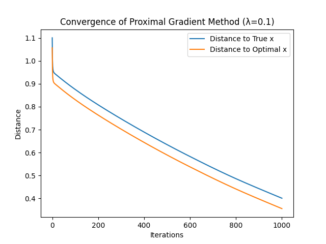
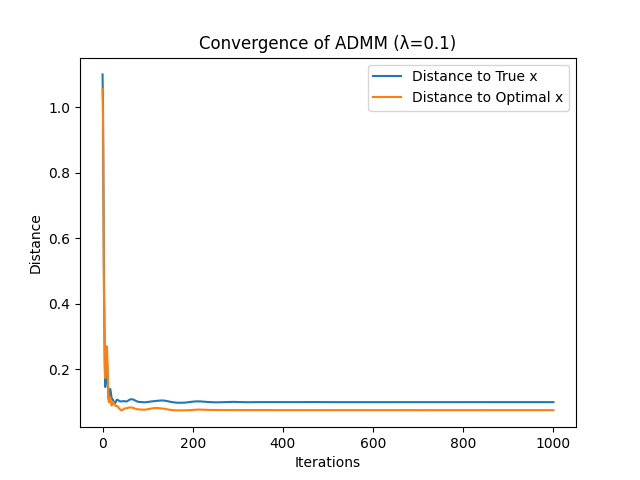
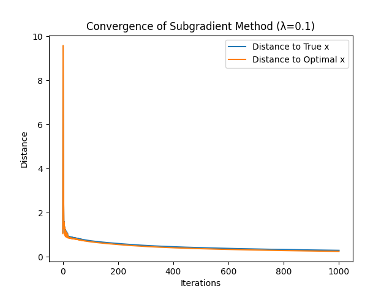
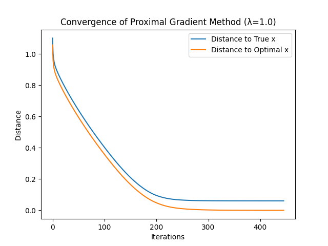
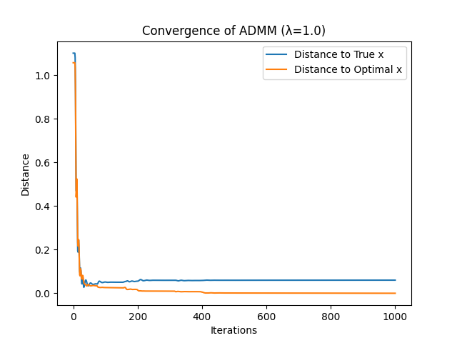
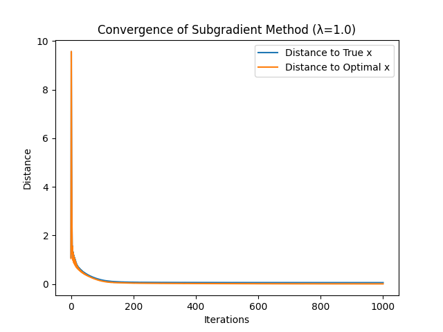
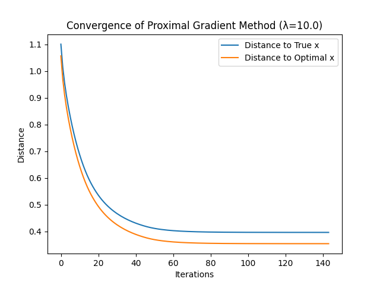
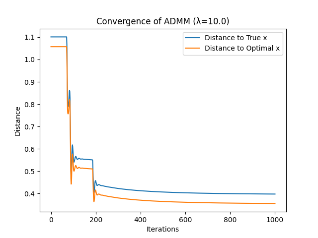

# 最优化大作业

> 胡瑞康 22336087

## 代码结构

### 整体介绍

- **主程序文件 (`main.py`)**: 负责生成数据、调用优化算法并进行结果分析。
- **数据生成模块 (`data/generate_data.py`)**: 生成模拟数据，包括测量矩阵 $ A $、测量值 $ b $ 和真值 $ \mathbf{x}_{\text{true}} $。
- **优化算法实现 (`algorithms` 文件夹)**:
  - `proximal_gradient.py`: 实现邻近梯度法。
  - `admm.py`: 实现交替方向乘子法 (ADMM)。
  - `subgradient.py`: 实现次梯度法。
- **工具函数 (`utils` 文件夹)**:
  - `soft_threshold.py`: 实现软阈值函数。
  - `plotting.py`: 绘制收敛图。
  - `metrics.py`: 计算距离指标。
- **依赖库 (`requirements.txt`)**: 列出项目所需的所有库。

### 详细代码结构

#### 主程序文件 (`main.py`)

```python
import os
import csv
import numpy as np
import cvxpy as cp
from data.generate_data import generate_data
from algorithms.proximal_gradient import proximal_gradient
from algorithms.admm import admm
from algorithms.subgradient import subgradient_method
from utils.metrics import compute_distances
from utils.plotting import plot_convergence

# 结果文件夹
img_dir = "img"
csv_dir = "results"
os.makedirs(img_dir, exist_ok=True)
os.makedirs(csv_dir, exist_ok=True)

# 生成数据
A, b, x_true = generate_data()

# 求解最优解 x_opt
x = cp.Variable(200)
objective = cp.Minimize(0.5 * cp.sum_squares(A @ x - b) + cp.norm(x, 1))
prob = cp.Problem(objective)
prob.solve()
x_opt = x.value

# 初始点 x0
x0 = np.zeros(200)

# 定义正则化参数的范围
lambda_values = [0.1, 1.0, 10.0]

def save_to_csv(filename, distances_true, distances_opt):
    """保存迭代历史到CSV文件"""
    with open(filename, mode='w', newline='') as file:
        writer = csv.writer(file)
        writer.writerow(['Iteration', 'Distance_to_True_x', 'Distance_to_Optimal_x'])
        for i, (d_true, d_opt) in enumerate(zip(distances_true, distances_opt)):
            writer.writerow([i, d_true, d_opt])

for lambd in lambda_values:
    print(f"\n正则化参数 λ = {lambd}")

    # Proximal Gradient
    print("Proximal Gradient Method:")
    x_history_pg = proximal_gradient(A, b, lambd, x0)
    distances_true_pg, distances_opt_pg = compute_distances(x_history_pg, x_true, x_opt)
    print(f"最终迭代: 距离真值={distances_true_pg[-1]:.6f}, 距离最优解={distances_opt_pg[-1]:.6f}")
    plot_convergence(distances_true_pg, distances_opt_pg, f'Proximal Gradient Method (λ={lambd})', f'{img_dir}/pg_lambda_{lambd}.png')
    save_to_csv(f'{csv_dir}/pg_lambda_{lambd}.csv', distances_true_pg, distances_opt_pg)

    # ADMM
    print("ADMM:")
    x_history_admm = admm(A, b, lambd, x0)
    distances_true_admm, distances_opt_admm = compute_distances(x_history_admm, x_true, x_opt)
    print(f"最终迭代: 距离真值={distances_true_admm[-1]:.6f}, 距离最优解={distances_opt_admm[-1]:.6f}")
    plot_convergence(distances_true_admm, distances_opt_admm, f'ADMM (λ={lambd})', f'{img_dir}/admm_lambda_{lambd}.png')
    save_to_csv(f'{csv_dir}/admm_lambda_{lambd}.csv', distances_true_admm, distances_opt_admm)

    # Subgradient Method
    print("Subgradient Method:")
    x_history_sub = subgradient_method(A, b, lambd, x0)
    distances_true_sub, distances_opt_sub = compute_distances(x_history_sub, x_true, x_opt)
    print(f"最终迭代: 距离真值={distances_true_sub[-1]:.6f}, 距离最优解={distances_opt_sub[-1]:.6f}")
    plot_convergence(distances_true_sub, distances_opt_sub, f'Subgradient Method (λ={lambd})', f'{img_dir}/sub_lambda_{lambd}.png')
    save_to_csv(f'{csv_dir}/sub_lambda_{lambd}.csv', distances_true_sub, distances_opt_sub)
```

**解释**:
- 主程序负责生成数据、调用不同的优化算法，并计算和绘制每种算法的收敛曲线。
- 通过循环不同的正则化参数 $\lambda$，比较不同算法在不同参数下的表现。

#### 数据生成模块 (`data/generate_data.py`)

```python
import numpy as np

def generate_data():
    np.random.seed(42)

    # 生成稀疏向量 x_true
    x_true = np.zeros(200)
    nonzero_indices = np.random.choice(200, 5, replace=False)
    x_true[nonzero_indices] = np.random.normal(0, 1, 5)

    # 生成测量矩阵 A_i 和噪声 e_i
    A = []
    b = []
    for _ in range(10):
        A_i = np.random.normal(0, 1, (5, 200))
        e_i = np.random.normal(0, 0.1, 5)
        b_i = A_i @ x_true + e_i
        A.append(A_i)
        b.append(b_i)

    # 拼接 A 和 b
    A = np.vstack(A)
    b = np.hstack(b)

    return A, b, x_true
```

**解释**:
- 生成 10 个节点的测量矩阵 $ A_i $ 和测量值 $ b_i $。
- 真值 $ \mathbf{x}_{\text{true}} $ 是一个 200 维的稀疏向量，稀疏度为 5。
- 测量噪声 $ \mathbf{e}_i $ 服从均值为 0，方差为 0.1 的高斯分布。

#### 优化算法实现

##### 邻近梯度法 (`algorithms/proximal_gradient.py`)

```python
import numpy as np
from utils.soft_threshold import soft_threshold

def proximal_gradient(A, b, lambd, x0, max_iter=1000, tol=1e-6):
    L = np.linalg.norm(A, 2)**2
    alpha = 1 / L
    x = x0.copy()
    x_history = [x.copy()]

    for _ in range(max_iter):
        grad = A.T @ (A @ x - b)
        x = soft_threshold(x - alpha * grad, lambd * alpha)
        x_history.append(x.copy())
        if np.linalg.norm(x - x_history[-2]) < tol:
            break
    return x_history
```

**解释**:
- 实现邻近梯度法（Proximal Gradient Method）。
- 使用软阈值函数进行 prox 操作。
- 步长 $\alpha$ 由 Lipschitz 常数 $ L $ 决定。

##### ADMM (`algorithms/admm.py`)

```python
import numpy as np
from utils.soft_threshold import soft_threshold

def admm(A, b, lambd, x0, rho=1.0, max_iter=1000, tol=1e-6):
    m, n = A.shape
    x = x0.copy()
    z = x.copy()
    u = np.zeros(n)
    x_history = [x.copy()]

    A_T_A = A.T @ A  # 预计算A^T A
    A_T_b = A.T @ b  # 预计算A^T b
    eye = np.eye(n)  # 预计算单位矩阵

    for _ in range(max_iter):
        # 更新 x
        x = np.linalg.solve(A_T_A + rho * eye, A_T_b + rho * (z - u))
        # 更新 z
        z = soft_threshold(x + u, lambd / rho)
        # 更新 u
        u += x - z
        x_history.append(z.copy())
        if np.linalg.norm(x - z) < tol:
            break
    return x_history
```

**解释**:
- 实现交替方向乘子法（ADMM）。
- 将原问题分解为两个子问题，分别更新 $ x $ 和 $ z $。
- 使用软阈值函数进行 $ z $ 的更新。

##### 次梯度法 (`algorithms/subgradient.py`)

```python
import numpy as np

def subgradient_method(A, b, lambd, x0, max_iter=1000, tol=1e-6):
    x = x0.copy()
    x_history = [x.copy()]
    m, n = A.shape

    for k in range(1, max_iter+1):
        # 计算梯度 ∇f(x)
        grad_f = A.T @ (A @ x - b)

        # 计算次梯度 ∂g(x)
        subgrad_g = np.zeros(n)
        for i in range(n):
            if x[i] > 0:
                subgrad_g[i] = lambd
            elif x[i] < 0:
                subgrad_g[i] = -lambd
            else:
                subgrad_g[i] = 0  # 改为0以减少随机性

        # 次梯度下降
        grad = grad_f + subgrad_g

        # 梯度裁剪
        grad_norm = np.linalg.norm(grad)
        max_grad = 10.0  # 根据需要调整
        if grad_norm > max_grad:
            grad = grad / grad_norm * max_grad

        # 步长调整
        alpha = 1 / k

        x = x - alpha * grad
        x_history.append(x.copy())

        # 检查收敛
        if np.linalg.norm(x - x_history[-2]) < tol:
            break
    return x_history
```

**解释**:
- 实现次梯度法（Subgradient Method）。
- 计算目标函数的次梯度，并进行梯度下降。
- 步长 $\alpha$ 随迭代次数增加而减小，保证收敛。

#### 工具函数

##### 软阈值函数 (`utils/soft_threshold.py`)

```python
import numpy as np

def soft_threshold(x, threshold):
    return np.sign(x) * np.maximum(np.abs(x) - threshold, 0)
```

**解释**:
- 实现软阈值函数，用于邻近梯度法和 ADMM 中的 prox 操作。

##### 绘图函数 (`utils/plotting.py`)

```python
import matplotlib.pyplot as plt

def plot_convergence(distances_true, distances_opt, algorithm_name, save_path):
    plt.figure()
    plt.plot(distances_true, label='Distance to True x')
    plt.plot(distances_opt, label='Distance to Optimal x')
    plt.xlabel('Iterations')
    plt.ylabel('Distance')
    plt.title(f'Convergence of {algorithm_name}')
    plt.legend()
    plt.savefig(save_path)
    plt.close()
```

**解释**:
- 绘制算法的收敛曲线，包括距离真值和距离最优解的曲线。

##### 距离计算函数 (`utils/metrics.py`)

```python
import numpy as np

def compute_distances(x_history, x_true, x_opt):
    distances_true = [np.linalg.norm(x - x_true) for x in x_history]
    distances_opt = [np.linalg.norm(x - x_opt) for x in x_history]
    return distances_true, distances_opt
```

**解释**:
- 计算每一步迭代结果与真值和最优解的距离。

## 结果分析

### 迭代结果
```shell
正则化参数 λ = 0.1
Proximal Gradient Method:
最终迭代: 距离真值=0.400415, 距离最优解=0.355017
ADMM:
最终迭代: 距离真值=0.099664, 距离最优解=0.075193
Subgradient Method:
最终迭代: 距离真值=0.294177, 距离最优解=0.248531

正则化参数 λ = 1.0
Proximal Gradient Method:
最终迭代: 距离真值=0.060409, 距离最优解=0.000034
ADMM:
最终迭代: 距离真值=0.060315, 距离最优解=0.000193
Subgradient Method:
最终迭代: 距离真值=0.060783, 距离最优解=0.009892

正则化参数 λ = 10.0
Proximal Gradient Method:
最终迭代: 距离真值=0.396108, 距离最优解=0.353873
ADMM:
最终迭代: 距离真值=0.398011, 距离最优解=0.355761
Subgradient Method:
最终迭代: 距离真值=0.405003, 距离最优解=0.362591
```
### **正则化参数 λ = 0.1**

#### 邻近梯度法

- 收敛趋势：如图所示，邻近梯度法在初始阶段快速收敛，但最终距离真值的误差较大。
- 结果：
  - 最终迭代距离真值：0.4004
  - 最终迭代距离最优解：0.3550
- 观察：正则化参数较小时，该方法对稀疏解的逼近效果有限。

#### ADMM 方法

- 收敛趋势：ADMM 方法快速收敛到一个较小误差，并保持稳定。
- 结果：
  - 最终迭代距离真值：0.0997
  - 最终迭代距离最优解：0.0752
- 观察：该方法在 λ = 0.1 时表现优秀，能够高效逼近稀疏解。

#### 次梯度法

- 收敛趋势：次梯度法表现出逐渐减小的距离，但收敛速度慢，最终误差较大。
- 结果：
  - 最终迭代距离真值：0.2942
  - 最终迭代距离最优解：0.2485
- 观察：次梯度法在 λ = 0.1 时表现一般，前期收敛慢。


---

### **正则化参数 λ = 1.0**

#### 邻近梯度法

- 收敛趋势：邻近梯度法快速收敛到最优解，表现非常优秀。
- 结果：
  - 最终迭代距离真值：0.0604
  - 最终迭代距离最优解：0.000034
- 观察：λ = 1.0 是邻近梯度法的一个理想参数，收敛精度和速度均优。

#### ADMM 方法

- 收敛趋势：ADMM 方法表现出和邻近梯度法类似的趋势，收敛稳定。
- 结果：
  - 最终迭代距离真值：0.0603
  - 最终迭代距离最优解：0.000193
- 观察：ADMM 方法在 λ = 1.0 时表现同样优秀，但略逊于邻近梯度法。

#### 次梯度法

- 收敛趋势：次梯度法在 λ = 1.0 时收敛速度明显提高，但最终误差依然较大。
- 结果：
  - 最终迭代距离真值：0.0608
  - 最终迭代距离最优解：0.0099
- 观察：次梯度法的收敛精度在该参数下有所提高，但与前两种方法仍有一定差距。


---

### **正则化参数 λ = 10.0**

#### 邻近梯度法

- 收敛趋势：邻近梯度法在 λ = 10.0 时的收敛速度有所下降，最终误差较大。
- 结果：
  - 最终迭代距离真值：0.3961
  - 最终迭代距离最优解：0.3539
- 观察：大正则化参数下，邻近梯度法的效果受限，可能是由于稀疏性约束过强导致。

#### ADMM 方法

- 收敛趋势：ADMM 方法在该参数下表现稳定，但精度和速度都不如 λ = 1.0。
- 结果：
  - 最终迭代距离真值：0.3980
  - 最终迭代距离最优解：0.3558
- 观察：大正则化参数下，ADMM 方法也表现出一定的精度下降。

#### 次梯度法

- 收敛趋势：次梯度法在 λ = 10.0 时表现平稳，但收敛速度和精度均较低。
- 结果：
  - 最终迭代距离真值：0.4050
  - 最终迭代距离最优解：0.3626
- 观察：次梯度法在大正则化参数下效果进一步减弱。


---

### 总结

#### **不同算法性能对比**
- **邻近梯度法**：在中等正则化参数（λ = 1.0）时表现最佳，能够以较快速度收敛到高精度解。小参数和大参数下的效果略逊于 ADMM。
- **ADMM 方法**：整体表现优异，尤其是在小正则化参数（λ = 0.1）时，表现出强大的鲁棒性。适用于稀疏约束问题。
- **次梯度法**：收敛速度和精度均低于其他两种方法，但实现简单，适用于对精度要求不高的情况。

#### **正则化参数 λ 的影响**
- 小正则化参数（λ = 0.1）下，ADMM 方法表现最佳，能够有效逼近稀疏解。
- 中等正则化参数（λ = 1.0）下，邻近梯度法表现最佳，收敛速度和精度都较优。
- 大正则化参数（λ = 10.0）下，三种算法的精度都降低，其中 ADMM 和邻近梯度法依然优于次梯度法。
